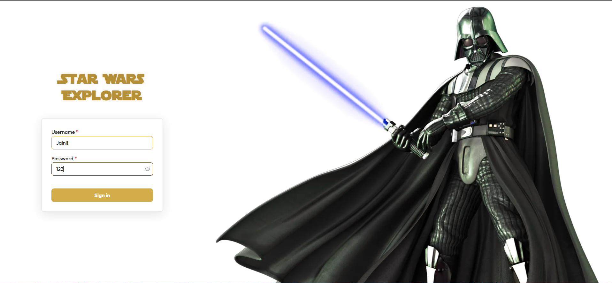
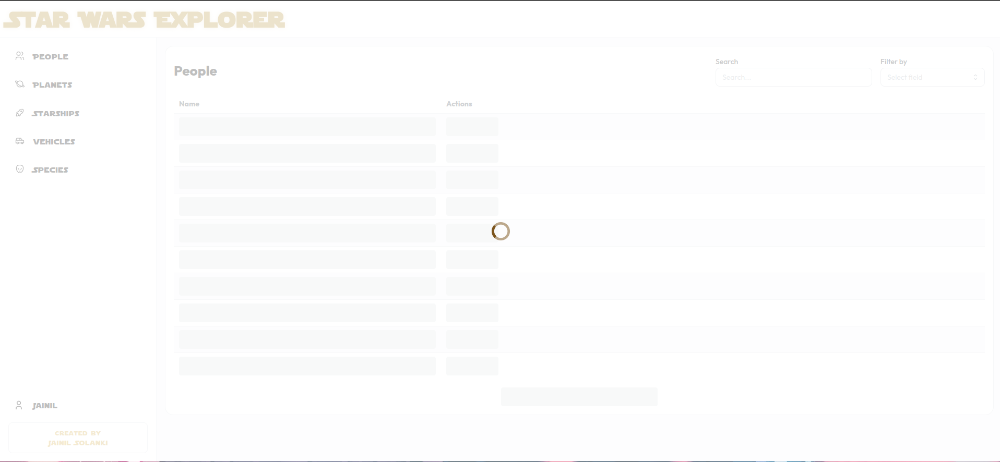
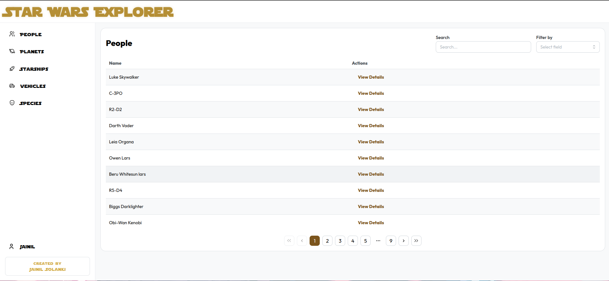
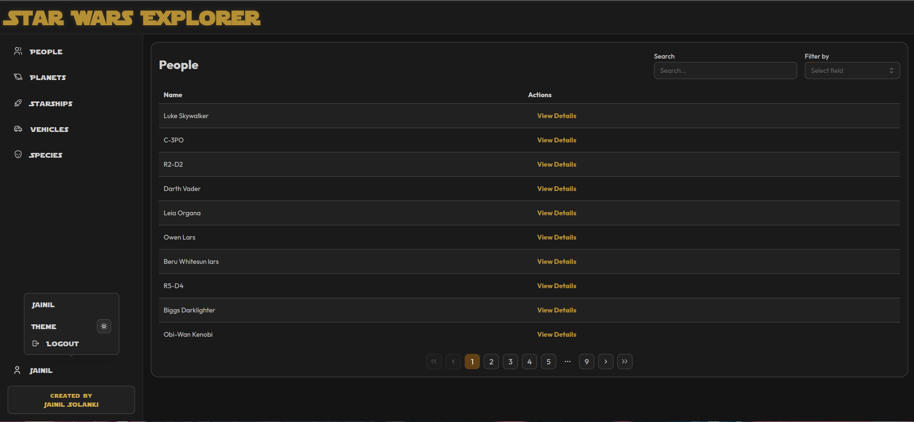
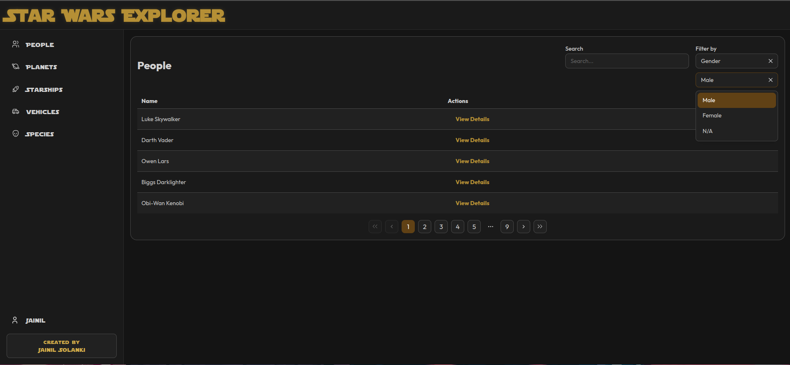
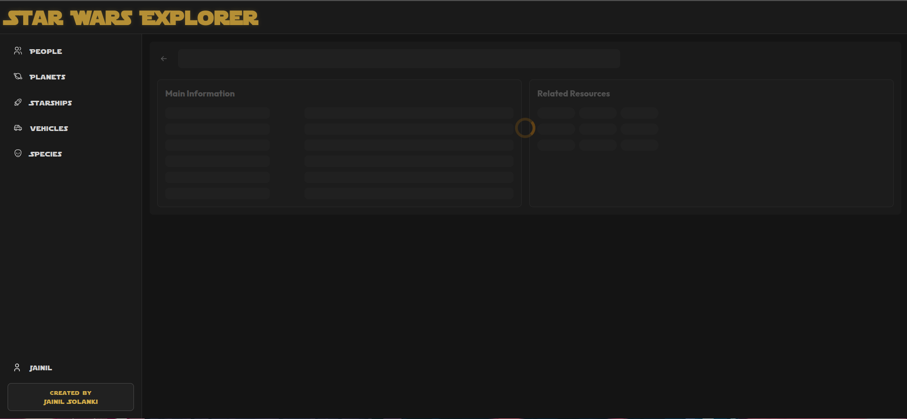
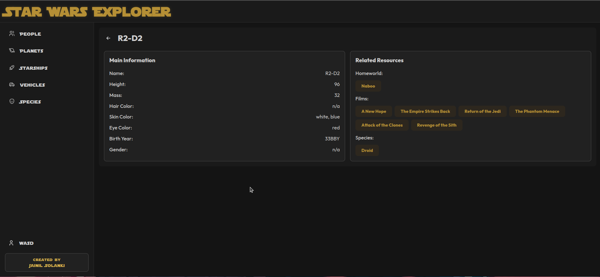

# Jainil Solanki - Script Assist Assessment

# Star Wars Explorer

#### Node version used: `v19.8.1`

#### React version used: `18.2.0`

#### [Live Preview](https://script-assist-assessment.vercel.app)

### Details

The Star Wars Explorer is an interactive web application that allows users to explore the vast universe of Star Wars through an intuitive interface. Built with React and TypeScript, the app features comprehensive routing and authentication, allowing users to browse through various Star Wars resources including characters, planets, vehicles, and more. The application uses the SWAPI (Star Wars API) to fetch detailed information, and implements features like search, filtering, and pagination for an enhanced user experience. With a sleek Mantine UI design system and a responsive layout, users can easily navigate through different categories, view detailed information about specific items, and toggle between light and dark themes for comfortable viewing.

### Steps to setup project

1. Clone github repo.
2. Open directory in terminal or your favourite editor and run the following command `npm i`.
3. After installing dependencies, run the following command `npm run dev` to start the development server.
4. Go to [http://localhost:port](http://localhost:port).
5. Enter any credentials to login and start using the app.

### Packages used

1. React
2. TypeScript
3. React Router
4. Mantine UI
5. Zustand (State Management)
6. React Query
7. SWAPI (Star Wars API)
8. Tabler/icons-react

### Features

1. Authentication System with Protected Routes
2. Dynamic Resource List and Detail Views
3. Search and Filter Functionality
4. Completely Responsive Design for all devices
5. Dark/Light Theme Toggle
6. Star Wars-themed UI
7. Pagination Support

### Video Demo

[Screencast from 05-12-24 10:45:41 AM IST.webm](https://github.com/user-attachments/assets/9ebdc011-847a-4149-ac2a-22ff6e257e16)

### Previews

